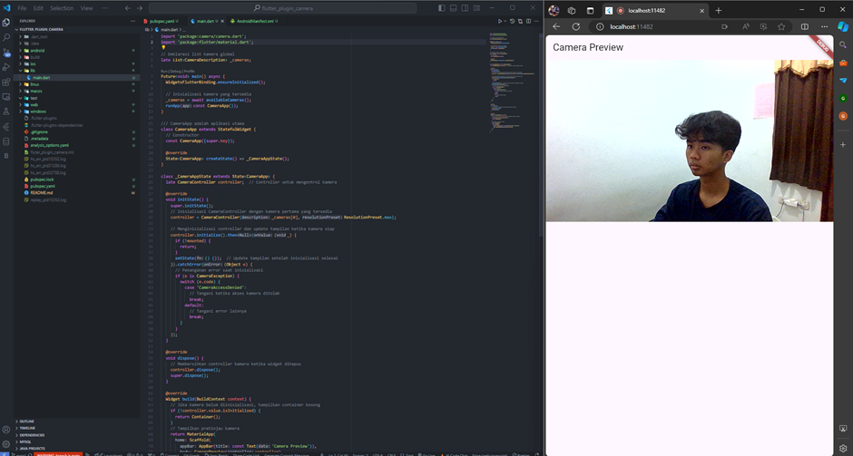
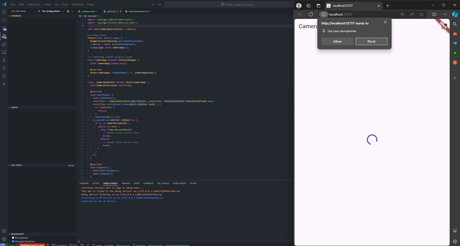
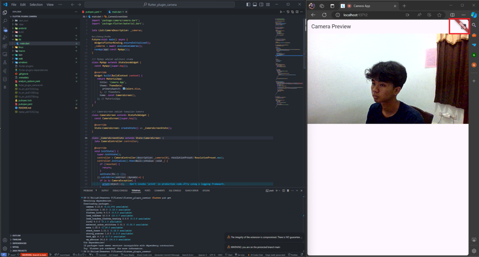
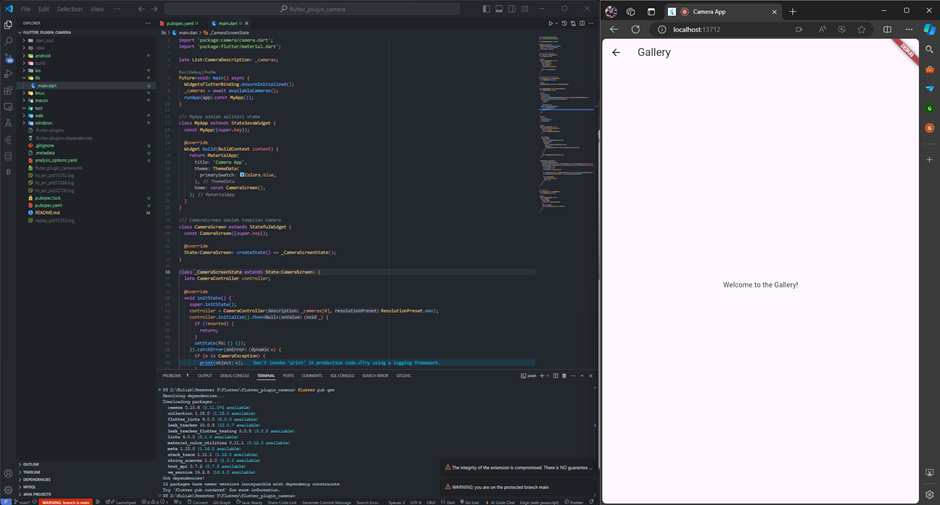

# TUGAS PRAKTIKUM PERTEMUAN 7
#  Manajemen Plugin   

### Nama : Cyndu Fathur Rohman
### Kelas : TI-3G
### No Absen : 10   

### Tugas 
#### 1. Tambahkan plugin untuk fungsi kamera pada aplikasi kelompok Anda. Misalnya menggunakan plugin ini https://pub.dev/packages/camera (silakan boleh gunakan plugin lain)

#### 2. Tambahkan plugin animasi loading dan transisi pada aplikasi OCR kelompok Anda.
Animasi Loading :

Navigasi:
- Menu tombol menu Galery

- Menu Galery

